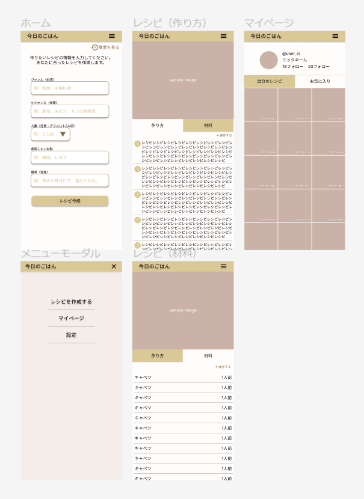

#　レシピ生成アプリ

## サービスイメージ

## 技術スタック

- 状態管理：recoil
- CSS フレームワーク：tailwind
- データフェッチ：SWR
- テスティングフレームワーク : jest
- コンポーネント管理：storybook

## ディレクトリ構成

| ルート   |              | 役割                                    |
| -------- | ------------ | --------------------------------------- |
| public   | -            | アセット                                |
| src      | app          | ルーティング                            |
|          | components   | コンポーネントファイル（atomic design） |
| 　　　　 | constants    | 定数                                    |
| 　　　　 | feature      | 機能                                    |
| 　　　　 | hooks        | カスタムフック                          |
|          | libs         | ライブラリの初期設定                    |
|          | repositories | データフェッチ                          |
|          | stores       | 状態管理                                |
|          | types        | 型定義                                  |

## ページ

- 入力フォーム
- レシピ
  - 作り方タブ
  - 材料タブ
- マイページ
- （モーダル）メニュー

## TODO

- 命名規則
- ホスティング
